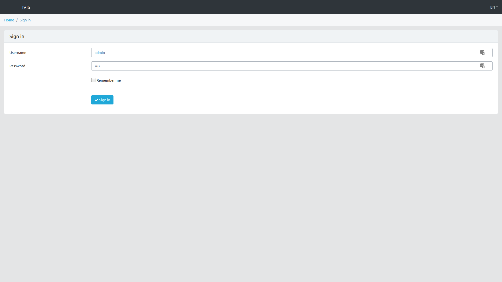
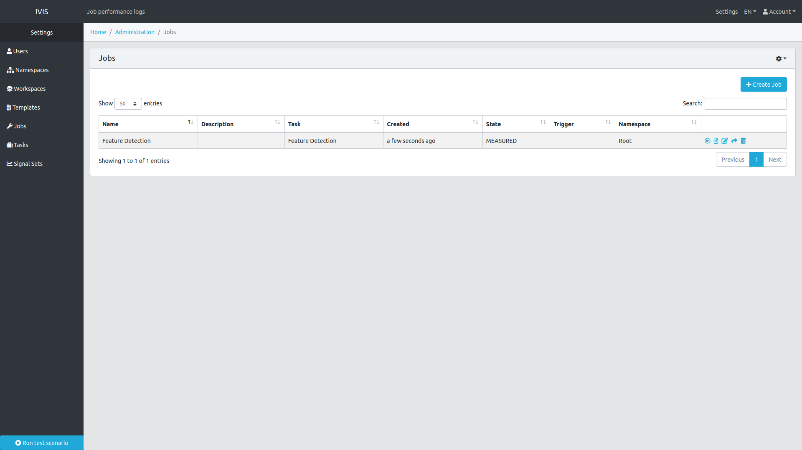
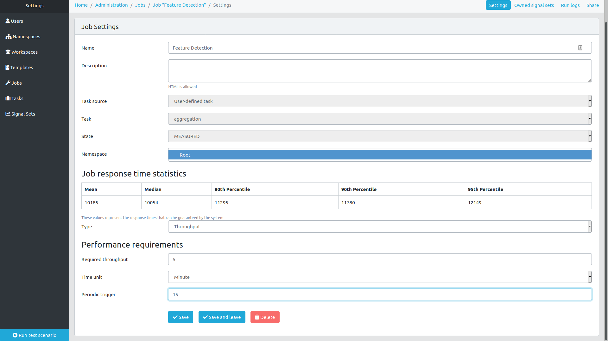
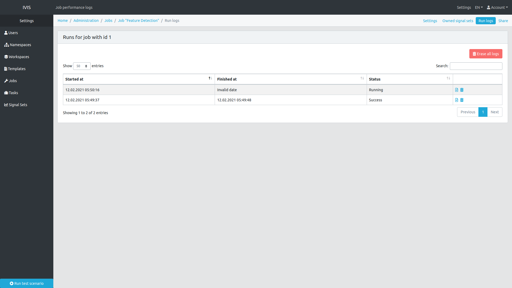
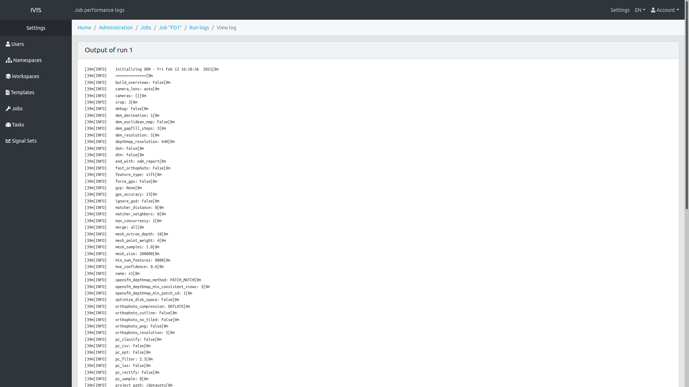
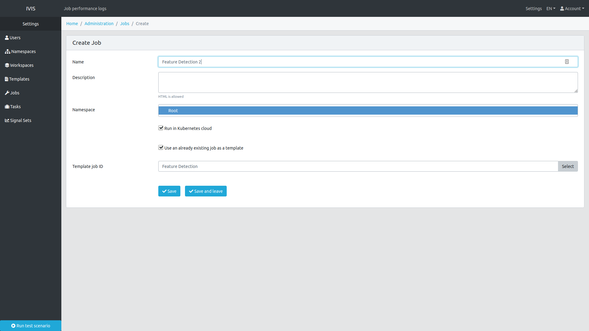
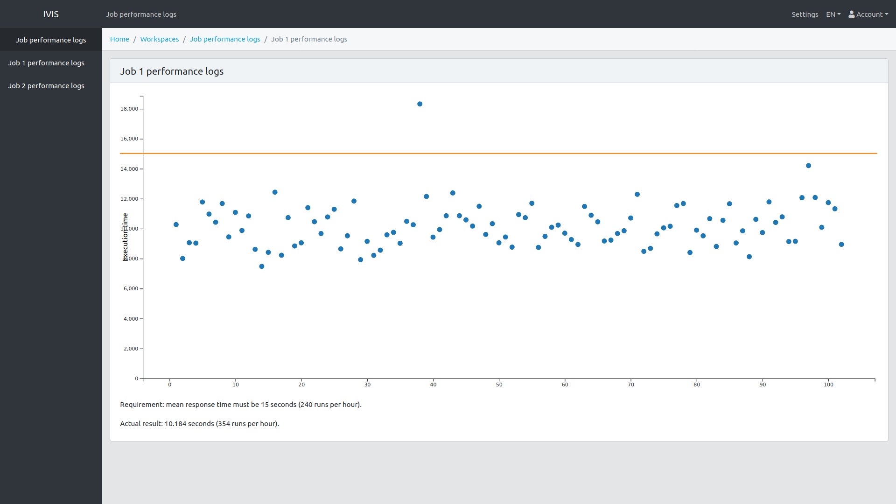

# Self-adaptive K8S Cloud Controller for Time-sensitive Applications

The framework can be installed with the Vagrantfile located in the `setup` folder (see Installation section).
The setup consists of 3 virtual machines. 
Two of them are running Kubernetes nodes, and the third runs the cloud controller and the IVIS platform.
The functionality of the cloud controller can be accessed through the IVIS web interface.

## Installation

### Hardware requirements

The VMs in this setup take 10 GB of RAM and 6 CPUs combined.

### Prerequisites

In order to set up the VMs, you need to have Vagrant and Ansible installed.

On Fedora, they can be installed with the following command:

```
dnf install vagrant ansible
```

On Ubuntu the same can be achieved with the following:

```
apt-get update && apt-get install software-properties-common && apt-add-repository ppa:ansible/ansible && apt-get update
apt-get install vagrant ansible
```

### Setting up the VMs

The VMs can be created with the following commands (executed from the folder where Vagrantfile is located)

```
vagrant box add d3s/controller
vagrant box add d3s/k8s-node
vagrant up
```

After `vagrant up` finishes execution, you will be able to access the IVIS interface through your browser

In order to destroy the VMs, run `vagrant destroy -f` from the same directory.

## Usage

1. You can access the IVIS web interface through your browser at localhost:8080.

2. The username to log in with is "admin", and the password is "test".

   

3. Once you have logged in, go to Settings, and press "Run test scenario" button. 
   This will create several initial IVIS entities to work with.

4. Go to the "Jobs" panel. In the list of jobs you should see the Feature Detection job. 
   If it is in the MEASURING state, wait a couple of seconds and refresh the page, the job will get to the MEASURED state.
   Once the job is in the MEASURED state, press the Edit icon next to the job entry.
   
   

5. At the bottom of job edit page, you can specify the QoS requirements for the job. 
   The table on that page shows the best possible values of response time that can be guaranteed at different percentiles.
   You can specify whether you want to set a response time requirement or a throughput requirement in a dropdown list.
   For response time requirements, you have to specify the percentile (1 to 99), and a time limit in seconds 
   (note, that the response time values in the table are milliseconds).
   The throughput requirements are expressed as the number of runs that have to be executed in some time period 
   (e.g. 4 runs per minute).    
   Additionally, you can set a time trigger for the job. 
   In this case, the job will be executed periodically with the specified interval.
   After you finish QoS requirement specification, press "Save and Exit".
   
   

6. Depending on the viability of the specified QoS requirement, the job will get into either ACCEPTED or REJECTED state.
   If the job was accepted, it will get into the DEPLOYED state after some time. 
   For the first instance of the job, the deployment may last several minutes, depending on your internet connection
   (this is due to the fact that a Docker image for the job needs to be downloaded).
   Additional instances that use the same Docker image are usually deployed within 10 seconds. 

7. After the job gets into the DEPLOYED state, you can execute a run of the job by clicking the "Run" button next to the job entry.
   This way the job can be executed manually, if a periodic trigger was not specified.

8. You can access the run logs of the deployed job by clicking the "Logs" button. Each entry in the table corresponds to an individual run.

   

9. Clicking "View Run output" next to an entry corresponding to a completed run will show you the logs of that run. 
   If the run status is "Success" it will show the standard output of that run. If the status is "Failed", it will show the standard error output.
   
   

10. You can add more instances of the same job by clicking "Add job" button.
   It will open a new job settings page.
   There, you have to specify the name for the job, and check the "Run in Kubernetes cloud" and 
   "Use an already existing job as a template" boxes.
   Then, choose a template job from the dropdown list (only the jobs in ACCEPTED and DEPLOYED states are displayed in the list).
   Finally, press "Save and Exit".
   The new job will copy all the properties of the template job, including the QoS requirement and time trigger. 
    
   

11. Since the cluster is very small, the number of instances that can run at the same time is very low due to memory limitations.
    Normally, you will be able to add 1 to 4 instances, depending on the strictness of the QoS requirement that you set.
    Additional instances will not be deployed (in the jobs table they will be displayed with NO_RESOURCES state). 

12. Visualizations of job performance can be accessed in "Workspaces/Job performance logs". 
      There, you can choose a panel from the list in order to see a visualization for the corresponding job.
      Note that a visualization will not be displayed if there are no completed runs of the job (since there are no data to visualize).

   

## Configuration

There are two main ways in which you can configure the framework for the purposes of your own use case. Minor alterations can be done by modifying the framework settings in the configuration files, while substantial implementation changes can be introduced via the extension manager. Below we explain these two methods in detail.

### Modifying the settings

The framework settings can be configured in the framework configuration files located in the `config` folder. For instance, in order to turn on the statistical predictor you need to set `STATISTICAL_PREDICTION_ENABLED` variable to `True` in the `config/main-config.yaml` file.

The settings relevant to the middleware library are located in the `config/middleware-config.yaml` file. If you want to build a custom Docker container to use with the framework, it is important to make sure that the middleware settings with which the container was built are the same as those used by the running instance of the framework.

### Using the extension manager

The `ExtensionManager` class provides several methods that can be used to compose a custom version of the framework by changing the implementation of its submodules. The submodules that can be changed include both the predictor and all components of the scheduler (monitor, analyzer, planner, executor, knowledge).

Customization can be done in two ways: by altering the default implementation of that submodule (e.g. adding a constraint to the constraint satisfaction problem solved by the analyzer module), or by substituting the whole submodule with a different implementation that conforms to the same interface. After specifying all modifications, you can retrieve an instance of `AdaptationLoop` class from the extension manager. This class connects all submodules together and manages their interactions.

The code listing below provides an example of scheduler customization.

```python
# First, we need an instance of the extension manager: 
extension_mgr = ExtensionManager()

# Now, let us change the objective function for the CS problem: 
analyzer: CSPAnalyzer = extension_mgr.get_default_analyzer()
objective = NewObjectiveFunction(analyzer.variables)
analyzer.set_objective_function(objective)

# Adding support for new tasks works in the following way:
executor: TaskExecutor = extension_mgr.get_default_executor()
executor.add_execution_context(CustomExecutionContext())
executor.add_task_type(CustomTask, CustomExecutionContext)

# Changing the monitor for a different implementation:
knowledge: Knowledge = extension_mgr.get_default_knowledge()
monitor = CustomMonitor(knowledge)
extension_mgr.set_monitor(monitor)

# Getting the customized adaptation loop.
# After this call the extension manager will not allow us to 
# do any more modifications:
adaptation_loop = extension_mgr.get_adaptation_loop()
adaptation_loop.start()
```

Similarly, the prediction method used in the framework can be changed with the following steps:

1. Create an implementation of the `Predictor` abstract class (located in `cloud_controller.analyzer.predictor` module).
2. Instantiate that implementation.
3. Provide the instance of your custom predictor to an instance of `ExtensionManager`.
4. Get the adaptation loop from the extension manager and run it.

